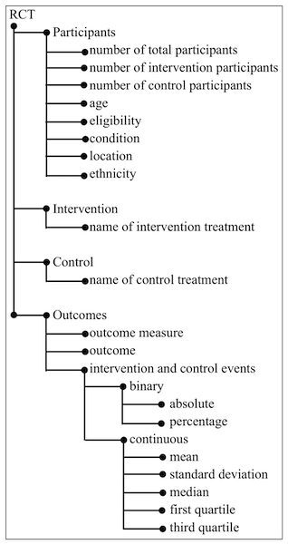

# PICO-Corpus
The corpus consists of about 1,011 PubMed abstracts which are RCTs related to breast cancer. For each abstract, text snippets that identify the Participants, Intervention, Control, and Outcome (PICO elements) are annotated.
The abstracts were annotated using BRAT (https://brat.nlplab.org/).
We shared the brat annotated files.


# PICO label hierachy 



# Example annotated abstract 


# Citation
If you use this dataset please cite our paper:
```
@article{mutinda2022automatic,
  title={Automatic data extraction to support meta-analysis statistical analysis: a case study on breast cancer},
  author={Mutinda, Faith Wavinya and Liew, Kongmeng and Yada, Shuntaro and Wakamiya, Shoko and Aramaki, Eiji},
  journal={BMC Medical Informatics and Decision Making},
  volume={22},
  number={1},
  pages={1--13},
  year={2022},
  publisher={BioMed Central}
}
```

